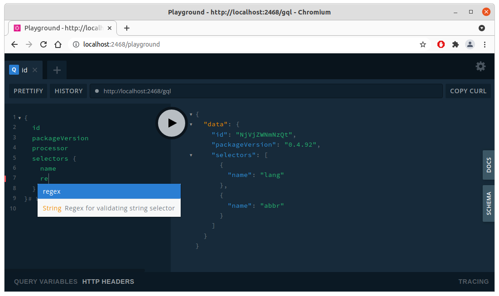

.. _interacting_graphql_playground:

#####################################################
Interacting with Proskomma using a GraphQL Playground
#####################################################

Fire up proskomma-node-express:

.. code:: bash

   git clone git@github.com:mvahowe/proskomma-node-express.git
   cd proskomma-node-express
   npm install
   npm run dev

Node Express should now be listening on port 2468 of localhost. The playground is at

.. code:: bash

  http://localhost:2468/playground
